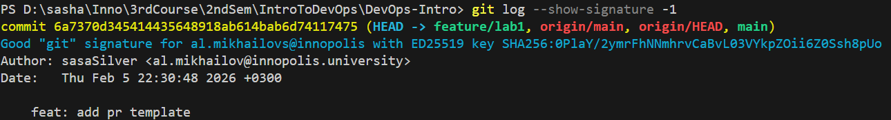
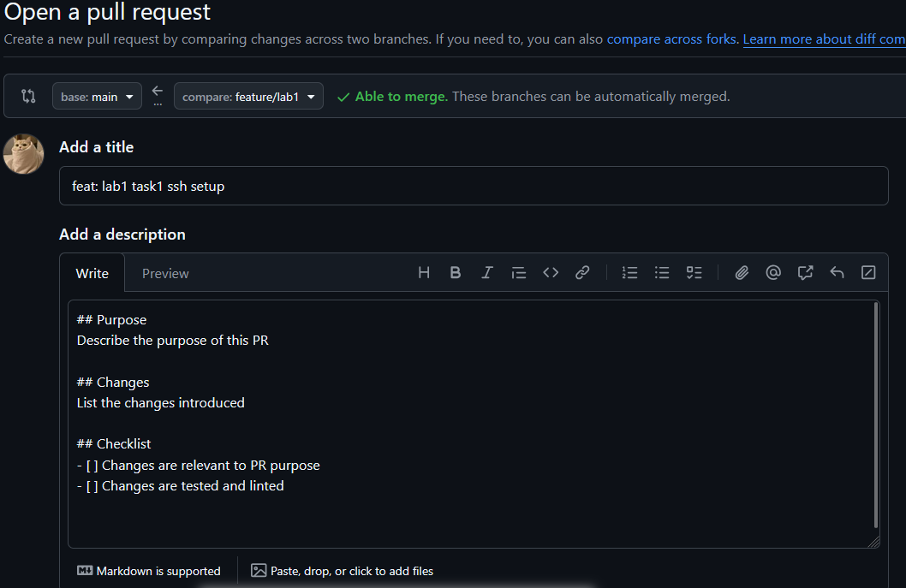
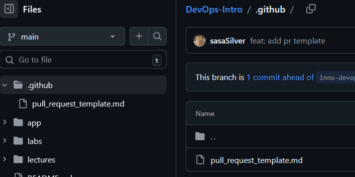

# TASK 1

## 1. Benefits of Signed Commits
Signing commits cryptographically proves you authored the code, preventing impersonation and tampering. It establishes trust, accountability, and is essential for security in collaborative and regulated environments.

## 2. Evidence of SSH Key Setup and Signed Commit

## 3. Why is commit signing important in DevOps workflows?
Commit signing is critical in DevOps workflows as it verifies the integrity and origin of every change, ensuring only authenticated code progresses through the CI/CD pipeline. This creates a secure, auditable chain of custody from developer to deployment, which is foundational for compliance and robust supply chain security.

## 4. Verification of the "Verified" badge on GitHub

# TASK 2

## 1. PR template auto-filling

## 2. PR template on main branch

## 3. How PR templates improve collaboration
PR templates improve collaboration by standarticizing PR format of each team member. They also act as reminders on PR quality (changes are tested/linted, related to a specific task/goal that this PR aims to accomplish)

## 4. Challenges during setup
I encountered a small challenge in the first task, not this one.

I didn't understand why my commits didn't seem to be signed.
`git log --show-signature` kept showing `NOT VERIFIED`. Turns out, it was actually signed, but git couldn't validate signatures because I didn't add "allowed signers" in git config. (Solved thanks to this StackOverflow answer https://stackoverflow.com/a/77936238/31945384)